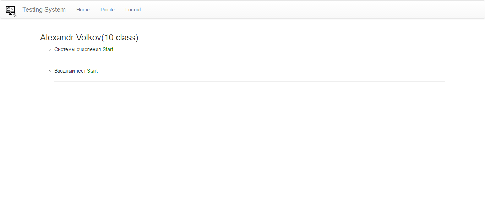
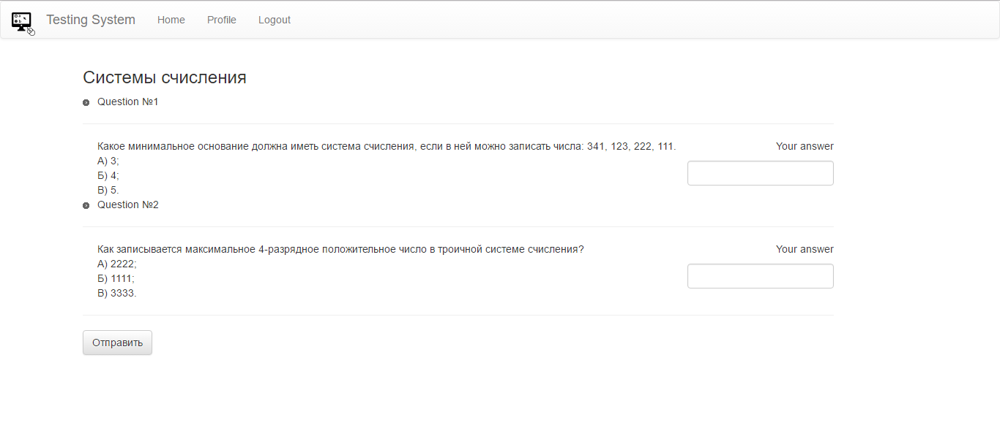
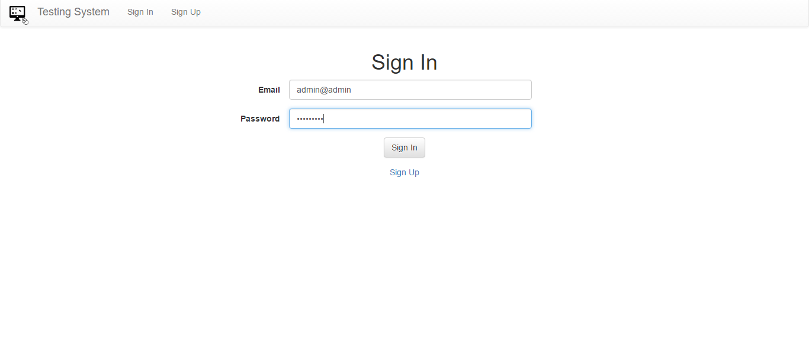
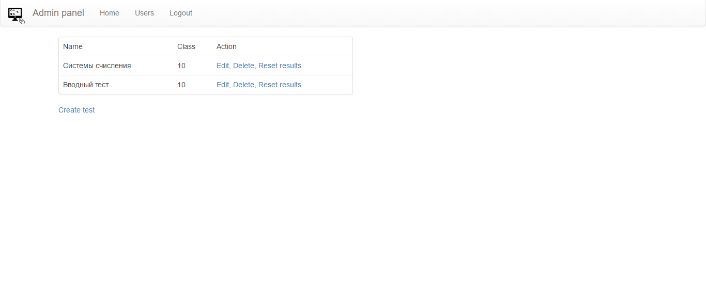
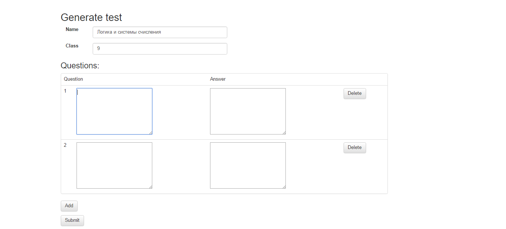

# Testing-system

A simple system of online tests

# Used technology
- Java(1.8)
- Jetty(WebServer)
- Maven
- MySql
- Bootstrap 3

# Screenshots
- List of tests

- Test

# Admin panel
- Login

- Test management

- Generate test

# Settings
1. Configure Web servers are located in the file cfg/config.properties
2. Run a web server via the file start.bat/start.sh
3. Build the jar file - assembly.bat/assembly.sh
